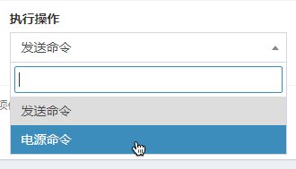

# 使用计划任务


使用计划任务需要你的面板服务商在他们的服务器上率先设置好 crontab 任务，然后自己配置的计划任务才能被执行。否则，计划任务永远无法被执行。

👉 具体表现是任务永远不会出现“上次运行”日期，但“下次运行”显示正常，而且按照“下次运行”日期推算任务本应已经运行多次，但是它就是不执行。


## 😋 创建一个计划任务

创建一个计划任务非常容易。你只需要找到侧边栏，然后点击 **Create New** 按钮即可。

## ✍ 配置你的计划任务

点击 Create New 后，你将进入新建计划页面：

这个页面分为两部分，第一部分你需要配置**计划任务的时间**，第二部分你需要配置这个任务**都需要做些什么**。


crontab 是用来让使用者在固定时间或固定间隔执行程序之用，换句话说，也就是类似使用者的时程表。_—— runoob.com_


自定义_计划任务的时间_ 时，使用的是 crontab 时间语法。[在这里](https://tool.lu/crontab/) 你能找到如何使用 crontab 语法的教程，并且可以在网页上实时计算任务接下来几次的执行时间。

你可以在网上百度到很多有关如何配置 crontab 时间的教程，在这里不再赘述。下面是几种时间预设：















## 💭 让定时任务有事可做 - 添加执行操作

翼龙支持定时任务做两件事：执行命令、操作服务器开关机。

### 💻 定时执行指令

定时执行指令非常简单，执行操作改为发送命令，然后输入任务内容\(也就是指令，不需要带/哦\)，最后点击右下方新建/修改任务即可。当然，如果想要在一个计划任务中执行多条指令也非常简单：

点击右下角**“添加其他任务”**，你就可以在一个计划任务中执行多个操作/指令了。

### ⚡ 操作服务器电源

你可以通过计划任务操作服务器重启/开启/关闭/杀进程。只需要在执行操作处选择**电源命令**。

你可能会郁闷：就给了我一个文本框，我填啥呢？

没关系，照着下面的填就行 👇

| 填写的内容 | 能干啥 |
| :--- | :--- |
| start | 开服 |
| stop | 关服 |
| restart | 重启（翼龙负责） |
| kill | 强制杀死服务器 |

上面的电源指令是等同于你在面板中开关的，所以无需担心服务器重启不成功 - 服务端自己崩溃除外😂。

## ✍ 管理计划任务

管理计划任务非常简单：

如果我们选择更改状态会怎么样呢？我们更改一下定时重启任务的状态，看看会发生什么：

这个可怜的任务变透明了，而且下次运行也变为了 _n/a_。这意味着这个任务不会被自动执行，假设你还没有设计好任务，想打个草稿的话，就可以将任务切换为非激活状态。别忘了用的时候再切换回去 \(小声

